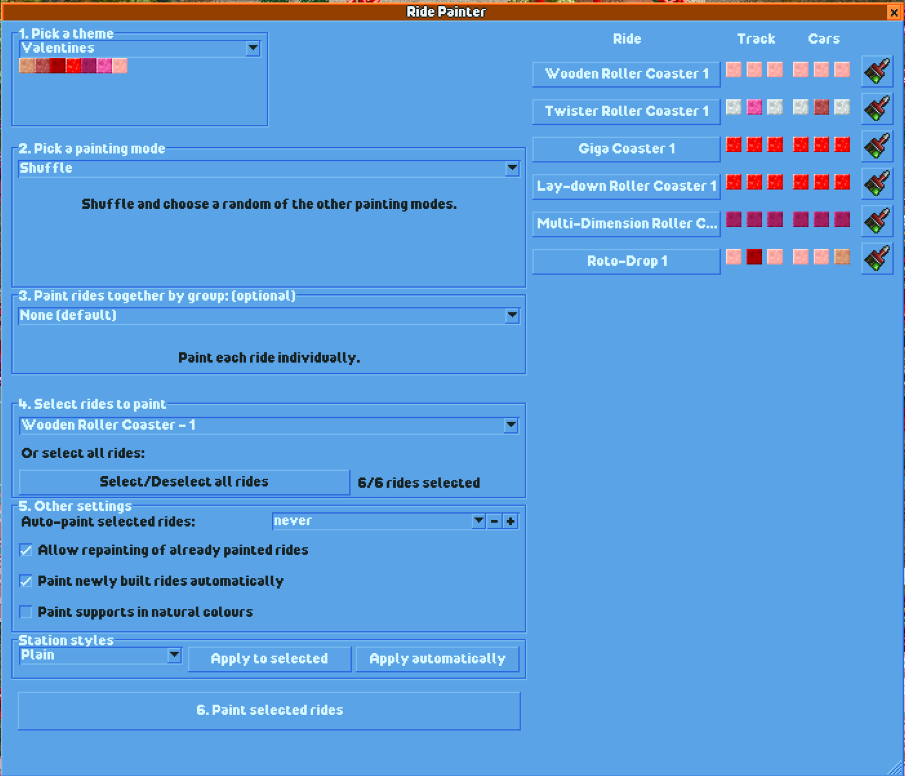

# Ride Painter - a plugin for OpenRCT2

## Overview

#### Ever wanted to:

- Paint every ride in your park at once?
- Recolour your rides every now-and-then to keep things fresh?
- Win the "Most Dazzling Colour Scheme" award?
- Make your 8 Ferris Wheels or 20 Corkscrew Coasters into a rainbow with one click?

#### The Ride Painter plugin makes recolouring your park a breeze!

 

## Changes

- FEAT: Added sidebar to show currently selected rides
  - Navigate to and paint individual rides from the plugin window.
- FEAT: Change station styles for selected rides
- FIX: Starting rides are no longer repainted accidentally if the toggle is selected

## Features

- Choose a theme colour palette & apply the colour scheme to your rides with multiple colouring modes.
- Automatically recolour your rides daily, weekly, monthly or annually.
- Colour your new rides as they're being built.

## Using the plugin

#### 0. Open the Ride Painter plugin

#### 1. Choose a colour theme.

#### 2. Choose a painting mode:

- **Monochromatic ride & track**: paint rides so that all the track and car pieces match, for an all-orange or all-pink ride.
- **Random colours**: paint every piece randomly from the theme colour palette.
- **Build order**: paint rides in the order they were built. If you combine this mode with the `Rainbow` theme, and then select a ride type you have 5+ rides of, you'll paint [Marcel's](https://www.youtube.com/c/MarcelVos "Marcel's") favourite scheme.
- **Custom pattern**: Lock in a colour for any/all of the 6 ride parts (track main, track additional, track supports, car main, car additional, car tertiary). Any toggle that is not activated will colour rides from the theme palette.

#### 3. Choose a grouping (optional):

- **None (default)**: every ride will go through the painting process separately. Some rides may end up with the same randomly selected colours, but most will be unique.
- **Ride type**: all rides of the same type will get the exact same paint job. This is useful if you want every ride of a type to be the exact same colour; you'll end up with 10 red Looping Coasters, 8 Orange Ferris wheels, etc.
- **Ride cost**: rides within the same price bracket of $2 will get painted the same way. So all rides between $2-$4, $4-$6, $6-$8, $8-$10, $10-$12, etc. and free rides will get the same paint job.
- **Ride age**: paint rides based on their age bracket for what guests are willing to pay. Useful if you want to maximize your ticket prices but find the Ride Price Manager too overpowered.

#### 4. Select rides to paint:

Choose a ride type from the dropdown, or select all rides.

#### 5. Adjust other settings (optional):

- If you want your rides to recolour automatically, choose a time interval from the dropdown (daily, weekly, monthly, annually).
- If you love your colour scheme and don't want to repaint your already-painted rides, disable the 'Allow repainting of already painted rides'.
- If you want your newly built rides to match the theme, enable the last toggle. It'll paint all new rides each day

#### 6. Paint your rides!

## Installation

1. Install a compatible version of OpenRCT2 (Works on 4.0.0+)
   - Downloads are here: https://openrct2.org/downloads
2. Download the plugin file here: https://github.com/ltsSmitty/OpenRCT-Ride-Painter/releases/latest
   - Put that file in your OpenRCT2 plugin folder.
   - It's typically in `C:\Users\{User}\Documents\OpenRCT2` on Windows.
   - For more info, see OpenRCT2's info on Plugins.
3. Run OpenRCT2!
4. Once in a scenario, open the Ride Painter window via the Map dropdown to configure the plugin.

## Multiplayer

The plugin should work in multiplayer, though I have yet to test it. I'd love feedback :)

## Future Plans

- Almost finished: Ability for users to create their own themes and share them to others.
- An 'undo' button to undo recent paints
- Ability to paginate through selected rides in the right column

## Feature Requests

If you want to request a feature or find a bug, open an issue on GitHub (as long as one doesn't exist already for the same thing). And if you like the sound of one of the Possible Future Plans and want it to happen, it's cool if you open an issue for it.

## Contributing

Since I built this plugin with Basssiiie's Flex-UI framework, this is an adequate example for how it functions, especially the MVVM store system.

At the moment, the only way to add new themes is by building from source, so this will be your only option if you want to add your own custom colour themes. You should be able to build the plugin from source and make a Pull Request to contribute, but I'm not 100% certain how to make that happen because my Github skills are shoddy :D

## Thanks

- Huge thanks to Basssiiie for the [Flex-UI](https://github.com/Basssiiie/OpenRCT2-FlexUI "Flex-UI") framework to build this from and guidance mid-build. I can't wait to see where it goes and hopefully contribute to it!
- This plugin is powered by wisnia74's excellent TypeScript plugin template. If you want to get started building your own OpenRCT plugins, it's an excellent place to start.
- Marcel Vos for showing me the need to paint lots of rides at once
- IntelOrca & the OpenRCT devs for their hard work on the PluginAPI. You've made an excellent game even better by putting these plugin options into our hands.
